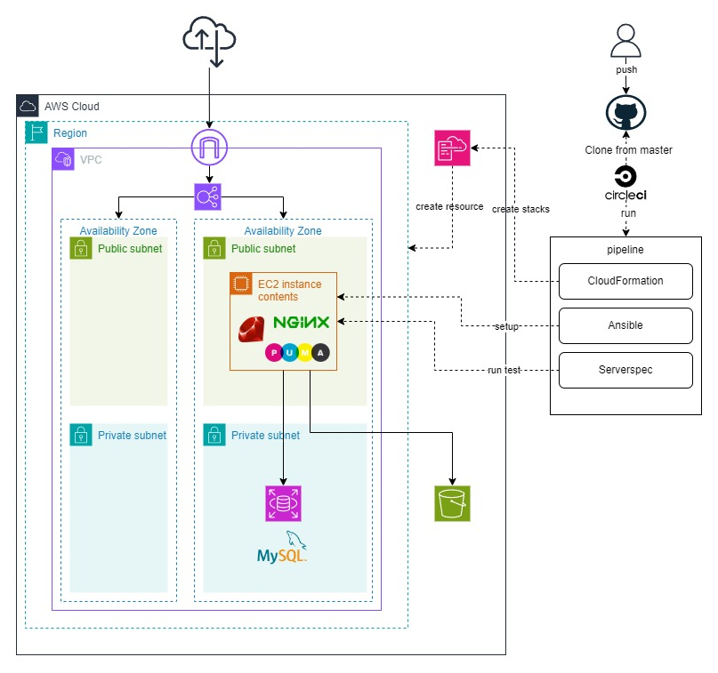

# AWSを用いたインフラストラクチャーの設計とIaC（Infrastructure as Code）での自動化

- 2023年11月よりAWS、およびIaCを用いての自動化の学習を行っております。
- **下記インフラストラクチャーの自動化**を行いました。

## 1.構成図



## 2.使用ツール

```text
1.CircleCI
- Cloudformation、Ansible、serverspecの実行

2.Cloudformation

- 第10回講義課題で作成したテンプレートを使用
- VPC、EC2、ELB、RDS、S3、IAMを作成

3.Ansible

- EC2へサンプルアプリケーション用の設定作業を行う
- MySQL、Ruby、Nginx、puma

4.serverspec

- ミドルウェア起動確認、アプリケーションレスポンス確認
```

## 3.完成したコードは[こちらのリポジトリ](https://github.com/murari-mura03/lecture13)となります。

## 学習内容

- 2023年11月よりオンラインエンジニアスクールRaiseTech AWSフルコースを受講。
- スクールでの講義内容、学習記録の内容となります。

| 講座   | 講義内容                                                                                                  | 提出課題                                                                                | 備考    |
| ------ | --------------------------------------------------------------------------------------------------------- | --------------------------------------------------------------------------------------- | ------- |
| 第1回  | AWS アカウントの作成<br>ルートユーザーの保護<br>IAM ユーザーの作成<br>cloud9でHelloWorldの実行            | [lecture01.md](lecture01.md)                                                            |         |
| 第2回  | Gitの基礎知識<br>GitHubアカウントの作成                                                                   | [lecture02.md](lecture02.md)                                                            |         |
| 第3回  | Cloud9でサンプルアプリケーションをデプロイ                                                                | [lecture03.md](lecture03.md)                                                            |         |
| 第4回  | VPC・EC2・RDSの作成、EC2からRDSへ接続                                                                     | [lecture04.md](lecture04.md)                                                            |         |
| 第5回  | 第4回で作成したAWSリソースを使用し<br>サンプルアプリケーションをデプロイ<br>ALB、S3を追加して構成図を作成 | [lecture05.md](lecture05.md)                                                            |         |
| 第6回  | システムの安定稼働<br>- CloudTrail<br>- CloudWatch<br>- Amazon SNS<br>コスト管理<br>- Cost Explorer<br>- Billing    | [lecture06.md](lecture06.md)                                                            |         |
| 第7回  | システムにおけるセキュリティの基礎<br>AWSでのセキュリティ対策<br>作成中の環境の脆弱性と対策の考察         | [lecture07.md](lecture07.md)                                                            |         |
| 第8回  | 第5回課題のライブコーディング①                                                                            | なし                                                                                    |         |
| 第9回  | 第5回課題のライブコーディング②                                                                            | なし                                                                                    |         |
| 第10回 | CloudFormationでこれまでに作成した環境を構築する                                                          | [lecture10.md](lecture10.md)<br>[cloudformation](cloudformation)                        | SAA取得 |
| 第11回 | ServerSpecのサンプルテストを実行                                                                          | [lecture11.md](lecture11.md)                                                            |         |
| 第12回 | CircleCIのサンプルコンフィグを実行                                                                        | [lecture12.md](lecture12.md)<br>[CircleCI](.circleci)                                   |         |
| 第13回 | サンプルアプリケーションのデプロイ環境をIaCで自動構築                                                     | [lecture13.md](lecture13.md)<br>[lecture13](https://github.com/murari-mura03/lecture13) |追加学習<br>[terraform.md](terraform.md)<br>[terraform](terraform)       |
| 第14回 | 第13回課題のライブコーディング①                                                                           | なし                                                                                    |         |
| 第15回 | 第13回課題のライブコーディング②                                                                           | なし                                                                                    |         |
| 第16回 | 【最終講義】<br>現場へ出ていくにあたって                                                                  | [README](README.md)の整理                                                                                    |         |
