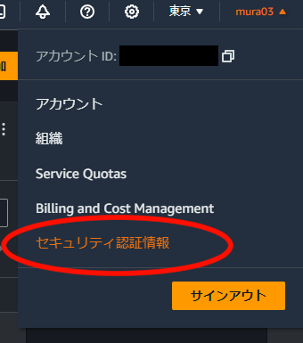
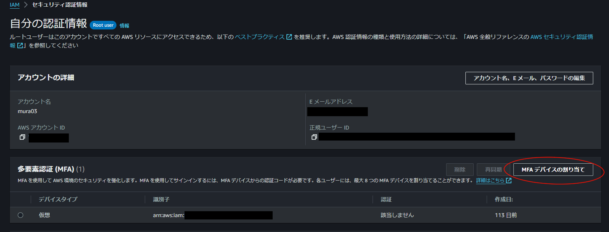
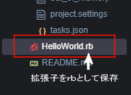

# 第1回講義課題

## AWSアカウント作成

```Markdown
 1. AWSアカウントを作成し、rootユーザーをMFAで保護する。
 2. BilingをIAMユーザーで閲覧できるように設定する。
 3. AdministratorAccess権限のIAMユーザーを作成し、こちらもMFAで保護する。
```

## Cloud9作成とHelloWorldの実行

```Markdown
 1. Cloud9をAmazon Linux2で作成。
 2. Rubyで"HelloWorld"が出せるようにコードを記載し実行する。  
 ```

<br>

# 課題内容

## AWSアカウントの作成

1. [AWS公式サイト](https://aws.amazon.com/jp/register-flow/)を参考にアカウントの作成を行う。
2. rootユーザーが作成できたらコンソール画面よりセキュリティ認証情報を選択。  
   
3. MFAデバイスの割り当てをクリックし、｢仮想MFAデバイス｣を選択。
   
4. 認証アプリで追加を選択し、QRコードを使い設定を行う。
5. BilingをIAMユーザーで閲覧できるように設定する。  
    - rootユーザーのアカウントタブで｢IAMユーザーおよびロールによる請求情報へのアクセス｣のアクティブ化にチェックを入れる。  
    
    - この操作でBillingに関するアクセス権があるポリシーがアタッチされているIAMユーザーで請求情報が見られるようになる。
6. IAMダッシュボードに移動し、ユーザータブへ移動。
7. ユーザーの詳細を入力。｢IAMユーザーを作成｣を選択する。
8. 許可の設定でAdministratorAccessを選択し、今回の場合は直接アタッチする。
    - ベストプラクティスとしてはグループにポリシーをアタッチすることを推奨しているので注意。
    - AdministratorAccessはAWSサービスおよびリソースへのフルアクセスを提供するAWSマネージドポリシー。あらゆるリソースが利用でき、IAMアカウントの新規発行や削除の権限やパスワードのリセット権限も所持している状態となる。([公式リファレンスガイド](https://docs.aws.amazon.com/ja_jp/aws-managed-policy/latest/reference/AdministratorAccess.html))
9. IAMユーザーでログインし、同様にMFA保護を行う。  
     - 許可ポリシーは作成後IAMユーザー画面からも追加が可能。
    

参考

- [AWS公式：IAM チュートリアル: 請求コンソールへのアクセス権の付与](https://docs.aws.amazon.com/ja_jp/IAM/latest/UserGuide/tutorial_billing.html)
- [AWSで多段階認証（MFA認証）を設定する](https://www.netassist.ne.jp/techblog/13605/ )
- [AWSの請求情報をIAMユーザーでも見れるようにしよう｜Koki Tamura](https://zenn.dev/k_tamu/articles/59ae03a2752522)

## Cloud9作成とHelloWorldの実行

1. Cloud9の管理画面へ移動し、環境を作成ボタンからCloud9の作成画面を起動する。

2. 新しいEC2インスタンスを選択。

3. 指定のAmazon Linux2を選択。

4. 作成が完了。EC2インスタンス、VPCなどが同時に作成されるため若干時間がかかる場合もあるので気長に待つ。

5. ｢開く｣ボタンをクリックすると起動が開始され、Cloud9の導入が完了。

6. 環境フォルダ上(この場合はLecture01)を右クリックし、Rubyファイルを作成する。
   
   

7. 作成したRubyファイルにエディター上でHelloWorldの記述をする。

8. ターミナルでコマンドを実行。HelloWorldが表示される。

9. 環境を削除し終了。


参考

- [0から始める！RubyでHello Worldを表示するまでの道のり](https://www.sejuku.net/blog/106332)
- [AWS Cloud9を導入して使い方を学ぼう](https://pikawaka.com/curriculums/programming-introduction/aws-cloud9)
- [AWS Cloud9 のすゝめ](https://qiita.com/hatahatahata/items/66c0a186b6bfe2f9ef7f)
