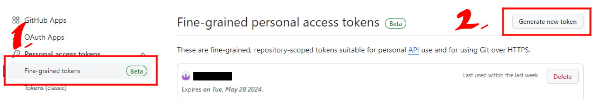
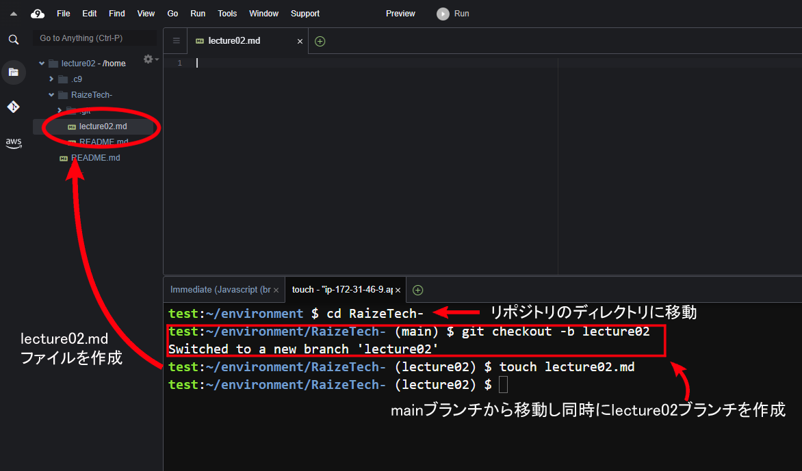

# 第2回講義課題  

## Cloud9 と GitHubを使用し、プルリクエストを使った学習報告を行う

```Markdown
1. GitHubアカウントの作成
2. 課題用リポジトリ作成と設定変更
    ・GitHubでPublic（公開設定）のリポジトリを作成
    ・作成したリポジトリの main ブランチにブランチ保護ルールをつける
        ◦ Pull Request必須
        ◦ 承認を要求(必要承認回数 1)
3. Cloud9のGit設定変更
4. Pull Request の発行と完了報告
    ・ 「ブランチ: lecture02」を作成。
    ・ 講座を聞いて感じたことを「lecture02.md」にMarkdownで書き、Pull Requestを発行。
```

## 課題作成手順

### 1. GitHub アカウントの作成

- [GitHub公式サイト](https://github.co.jp/)にアクセスして、ユーザー登録を行う。
- [公式サイト](https://docs.github.com/ja/github/authenticating-to-github/keeping-your-account-and-data-secure/creating-a-personal-access-token)を見ながら、GitHub 個人アクセストークンを作成。
- 二種類あるが`Fine-grained personal access tokens`が推奨。
- 有効期限は無期限で構わないが紛失しないよう注意。
- 書き込み権限は明示的に与える必要があり、忘れるとこの後 push で躓くので注意する。

| 方式                                  | 操作                                                                                                                                    |
| ------------------------------------- | --------------------------------------------------------------------------------------------------------------------------------------- |
| `Fine-grained personal access tokens` | `Repository access`・・・`All repositories`または作成済の操作したいリポジトリを選ぶ<br>`Permissions`・・・`contents` : `Read and write` |
| `classic`                             | リポジトリを条件に含められないので `repo`にチェック。                                                                                   |

<br>

- 右上のアイコンのsettingsへ移動。

- 左下のDeveloper settingsをクリック。

- `Fine-grained personal access tokens`を選択し`Generete new token`をクリック。

- 必要な権限を付与し作成完了。


### 2. 課題用リポジトリ作成と設定変更

- ダッシュボードからリポジトリを作成。

- 任意の名称をつけ、Pubulic設定にする。`READ ME.md`ファイルを同時に作成。

- リポジトリが完成。

- ブランチ保護ルールの設定。SettingsからBranchesを選択し、`Add branch protection rule`をクリック。

- "Branch name pattern"の下で、保護したいブランチの名前(今回はmain)を入力。
- 以下の設定を選択。
  - Pull Request必須
  - 承認を要求(必要承認回数 1)


- ブランチ保護ルールが設定される。


### 3. Cloud9のGit設定変更

- Git をはじめるにあたっての推奨設定へ変更を行う。
- 失敗時だけエラーが返ってくる。
  
```sh
# 新規リポジトリのデフォルトブランチ名をmainに変更
git config --global init.defaultBranch main

# ユーザー名とメールアドレス
# Gitは誰が変更したのかが重要な為、この設定が必須
git config --global user.name "ユーザー名"
git config --global user.email "メールアドレス"
```


- 個人メールアドレスを公開したくない場合こちらで受信専用のメールアドレス入手できる。


### 4. Pull Request の発行と完了報告

#### 1. GitHub リポジトリをクローンする。
- リポジトリの URL は、GitHub のリポジトリ画面の「Code」ボタンを押下すると表示される。


- ターミナルで以下のコマンドを実行。
  
```sh
# 既存のリポジトリをローカル環境に複製するコマンド
git clone https://???
# リポジトリのディレクトリに移動
cd ???
```

- このような表示が出れば成功。


#### 2. 作業用ブランチの作成と現在ブランチの切替(checkout)
- `lecture02`という作業用ブランチを作成し`main`から`lecture02`へ移動する。
- taouchコマンドでmdファイルを作成し、変更を加える。

```sh
git checkout -b lecture02

# 以下のコマンドでも結果は同じになる
# $ git switch -c lecture02

touch lecture02.md
```



#### 3. ファイルのステージング(add)
- 内容を変更した`lecture02.md`をステージングエリアに格納する。

```sh

git add git-lecture.md

# すべてのファイルをステージングする場合は、以下のコマンドでも良い。
# git add .
```

#### 4. ファイルのコミット

- `lecture02.md`をコミットする。


```sh
git commit -m "add lecture02.md"
```


#### 5. ステージング情報のプッシュ

- lecture02.mdをリモートリポジトリ（GitHub）へプッシュする。
- Passwordは先ほど作成した個人アクセストークン(PAT)を入力。(入力文字は見えない)

```sh
git push origin git-lecture

# git pushだけで実行すると指定が必要な元先のブランチ名称が返ってくる
#git push

# usernameを入力
```


#### 6. プルリクエスト（PR）

- GitHub のリポジトリ画面を確認すると、新しいブランチがプッシュされたことを検知しているため、`Compare&pull request`からプルリクエスト（PR）を作成する。
- タイトルと本文にはレビューしてほしいポイントや変更を加えた部分を簡潔に書いておく。


- ブランチ保護ルールを設定しているためこのようになる。

- マージが完了した画面。(今回はテストのためレビューなし)

- リポジトリ画面からlecture02.mdが追加されていることが確認できる。


#### 7. main ブランチでのマージ結果の確認

- ローカルPCにはまだ`main`ブランチの変更が反映されていないため、ブランチを`main`に切り替えて、`git pull`コマンドを実行する。

```sh
git checkout main
git pull
ls
cat lecture02.md
```


#### 8. 不要になったブランチの削除

- 作業用のブランチは自動で消えないため以下のコマンドで削除する。

```sh
git branch -d git-lecture
```

参考

- [ﾌﾞランチ保護ルールを管理する - GitHub Docs](https://docs.github.com/ja/repositories/configuring-branches-and-merges-in-your-repository/managing-protected-branches/managing-a-branch-protection-rule)
- [[Github]ブランチの保護ルール設定｜浮雲](https://zenn.dev/ukigumo_shiina3/articles/a862dc23b36cf0) #zenn 
- [GitHubを使ってpushすると、パスワードが求められた話](https://satoimo.blog/?p=1162)
- [GitHubの使い方を画像つきで徹底解説・初心者でもすぐ使える！](https://www.sejuku.net/blog/73468)
- [GitHubでのメールアドレス設定とGitクライアントでのメールアドレス設定 - サーバーワークスエンジニアブログ](https://blog.serverworks.co.jp/git-mail)