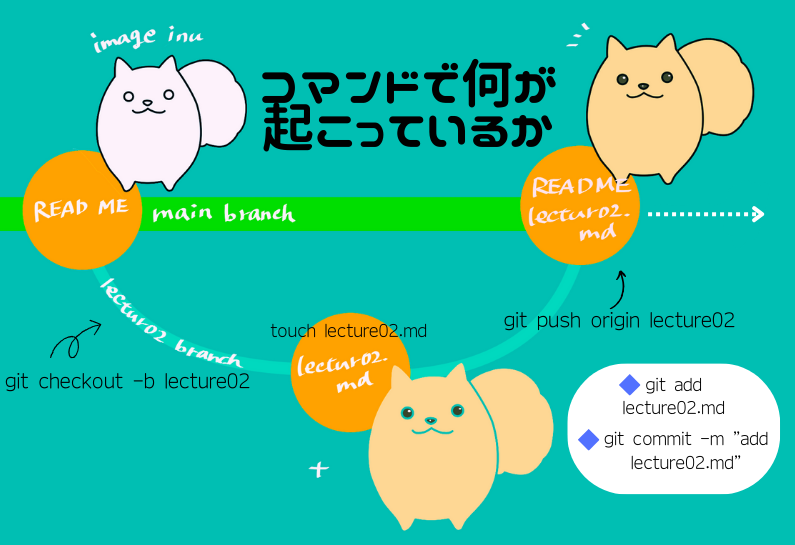
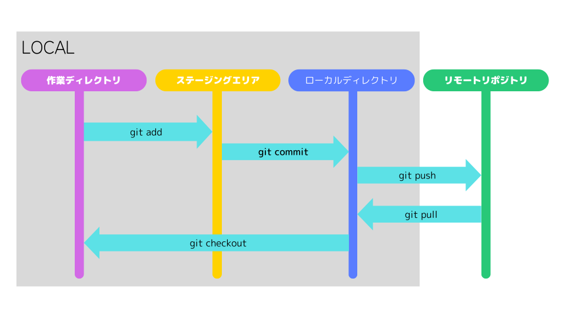

# 第2回講義補足事項

## GitとGithub

### Gitはバージョン管理システム

- Gitは、プログラムなどを記述したソースファイルを管理するための「分散型バージョン管理システム」のこと。
- 複数人で開発を行う際に、**ファイルの変更履歴をすべて反映させ、簡単に管理できる**のがGitの最大の特徴といえる。
- Gitの具体的な機能は、下記のとおり
  - ファイルの変更履歴を管理
  - 過去のバージョンに戻せる
  - さまざまなファイルを管理できる
  - チームで作業を共有できる
- Gitを使えば、「ある1つのファイルを2人で同時に編集してしまったために、先に編集した人の変更内容が消えてしまった」ということや「編集前の状態を記録するため毎回コピーしなければならない」ということがなくなる。

### GitHubはWebサービス

- Gitが「ファイルの変更履歴を管理するバージョン管理システム」であるのに対し、GitHubは「Gitの作業をチームメンバー間でやりとりできるWebサービス」を指す。
- GitHubは、大きく**自分のパソコン内に存在する｢ローカルリポジトリ｣** で作業を行い **Githubに存在する｢リモートリポジトリ｣** で管理を行う。
- GitHubを使った開発は、ローカルでファイルを作成・更新し、リモートリポジトリにアップデートする、という流れで行っていく。

## 今回使用したコマンド

```sh
# 新規リポジトリのデフォルトブランチ名をmainに変更
git config --global init.defaultBranch main

# ユーザー名とメールアドレス
# Gitは誰が変更したのかが重要な為、この設定が必須
git config --global user.name "ユーザー名"
git config --global user.email "メールアドレス"
```

```sh
git clone https://??? # クローンするリポジトリのURL
cd #作業するディレクトリに移動
git checkout -b `作成するブランチ名`
touch `作成するファイル名`
git add `ステージングするファイル` # この操作がされていないファイルはcommitされない
git commit -m "コミットする内容"
git push origin `プッシュするブランチ名`
```
- 各コマンドで何が起こっているかのイメージ図



### ステージングはなぜ必要か？

- Gitには「ステージング領域」または「インデックス」と呼ばれるコミットを完了する前にフォーマットして確認できる中間領域がある。
- ステージングとはコミットしたいファイルを指定する作業を指す。これにより誤って修正途中やコミットしたくないファイルをコミットするのを防ぐことが出来る。
  
参考

- [Git、GitHubを教える時に使いたい資料まとめ](https://qiita.com/yuyakato/items/41751848add5dfd5289c) #Qiita
- [GitHubの使い方を画像つきで徹底解説・初心者でもすぐ使える！](https://www.sejuku.net/blog/73468)
- [図解！ Gitのブランチ・ツリーをちゃんと読む](https://qiita.com/jesus_isao/items/2a0495c973a4c911c2cc) #Qiita 
- [サル以下の存在がまとめた「Git用語」図解](https://qiita.com/hamachi4708/items/6517b0964c6ed1685ecf)
