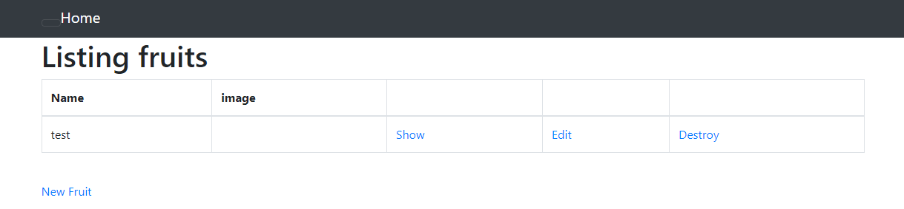

# 第三回講義課題  

```Markdown
1. サンプルアプリケーションをデモ通り起動(デプロイ)する。

2. AP サーバーについて調べる
   - AP サーバーの名前とバージョンを確認する。
   - AP サーバーを終了させた場合、引き続きアクセスできるか結果を確認して、APサーバーを再起動する。
3. DB サーバーについて調べる
   - サンプルアプリケーションで使った DBサーバーの名前と、Cloud9で動作しているバージョンはいくつか確認する。
   - DB サーバーを終了させた場合、引き続きアクセスできるか確認する。
   - Rails の構成管理ツールの名前を確認する。
```
- 使用した[サンプルアプリケーション](https://github.com/yuta-ushijima/raisetech-live8-sample-app.git)。

## 1.サンプルアプリケーションをデモ通り起動(デプロイ)する。

```sh
# サンプルアプリケーションをクローンする
$ git clone https://github.com/yuta-ushijima/raisetech-live8-sample-app.git

# アプリケーションのディレクトリへ移動
$ cd raisetech-live8-sample-app
'Required ruby-3.1.2 is not installed.
To install do: 'rvm install "ruby-3.1.2"''

# ruby-3.1.2がインストールされていないと表示
$ rvm install "ruby-3.1.2"
$ ruby -v # バージョンを確認
'ruby 3.1.2p20 (2022-04-12 revision 4491bb740a) [x86_64-linux]'

# 動作環境に必要なツールをそれぞれインストールする
# Bundler
$ gem install bundler:2.3.14
$ node -v
v18.17.1

# Node
$ nvm install 17.9.1
$ nvm use 17.9.1
Now using node v17.9.1 (npm v8.11.0)

# yarn
$ npm install -g yarn
$ yarn -v
1.22.21
$ yarn set version 1.22.19
$ yarn -v
1.22.19

# ディスク容量を確保する
$ docker system prune -a # 不要 Docker イメージを削除して空きを作る
# 元々インストールされているMariaDBを削除しMySQL8.0をインストールする
$ curl -fsSL https://raw.githubusercontent.com/MasatoshiMizumoto/raisetech_documents/main/aws/scripts/mysql_amazon_linux_2.sh | sh
```

- Mysqlの起動確認


```sh
# 初期パスワードの確認
$ sudo cat /var/log/mysqld.log | grep "temporary password" | awk '{print $13}'
# ログイン確認パスワード要求が出るので控えたパスワードを入力
$ mysql -u root -p
# 初期パスワードだと接続できないことがあるためパスワード変更
Mysql> ALTER USER 'root'@'localhost' IDENTIFIED BY '設定するパスワード';FLUSH PRIVILEGES;
mysql> exit
```

- MySQLへログインし、パスワードの変更を行う


```sh
# database.sample.ymlをコピーしdetabase.ymlファイルを作成
$ cp config/database.yml.sample config/database.yml 
# ソケットファイルの場所を確認
$ less /etc/my.cnf
> database.ymlファイルのpassword、soketを変更
```

- etc/my.cnf内の記述
  
  
- detabase.ymlファイルを変更

  

```sh
$ bin/setup
# エラーが発生
== Command ["bin/rails db:prepare"] failed ==
Mysql2::Error::ConnectionError: Can't connect to local MySQL server through socket '/tmp/mysql.sock' (2)
> MySQLサーバーに接続しようとした際にソケットが見つからなかった
> ファイル変更の保存忘れだったため保存後解消
```

```sh
$ bin/cloud9_dev
> bash: bin/cloud9_dev: Permission denied
# bin/cloud9_devの権限を変更
$ ls -l bin/
total 32
-rwxrwxr-x 1 ec2-user ec2-user 2945 Mar  2 04:43 bundle
-rw-rw-r-- 1 ec2-user ec2-user  158 Mar  2 04:43 cloud9_dev # 実行権限がない状態
-rwxrwxr-x 1 ec2-user ec2-user  152 Mar  2 04:43 dev
-rwxrwxr-x 1 ec2-user ec2-user  182 Mar  2 04:43 rails
-rwxrwxr-x 1 ec2-user ec2-user  131 Mar  2 04:43 rake
-rwxrwxr-x 1 ec2-user ec2-user 1068 Mar  2 04:43 setup
-rwxrwxr-x 1 ec2-user ec2-user  492 Mar  2 04:43 spring
-rwxrwxr-x 1 ec2-user ec2-user  521 Mar  2 04:43 yarn
# 所有者と所有者のグループに実行権限を付与
$ sudo chmod 774 bin/cloud9_dev
-rwxrwxr-- 1 ec2-user ec2-user  158 Mar  2 04:43 cloud9_dev
$ bin/cloud9_dev
```

- Blocked hostのエラーが出るためdevelopment.rbにconfig.hostsを追加記入


```sh
$ bin/cloud9_dev
```

- 手順通りにデプロイが完了した画面
   

## 2. APサーバーについて

- Puma version: 5.6.5
- アプリケーションサーバーの設定は、config/puma.rbやconfig/unicorn.rbなどのファイルに記述される。

   
- APサーバーを終了させた場合引き続きアクセスはできない。
- `Ctrl+C`で終了し、アクセスできないのを確認した後`bin/cloud9_dev`で再起動する。

- APサーバーはWebサーバーとDBエンジンサーバーの仲介役になってプログラムを実行するサーバー。
- APサーバーの持つ機能の中で代表的なものがデータベース接続機能とトランザクション管理機能。

## 3. DBサーバーについて

- mysql  Ver 8.0.35
- データベース接続の設定は、config/database.ymlファイルに記述される。

- DBサーバーの場合も停止させた場合引き続きアクセスはできない。
- `sudo service mysqld stop`で停止、`sudo service mysqld start`起動できる。

- APサーバーからの要求に基づいて、データを検索したりするサーバーをDBサーバーという。
- またデータベースの機能を提供するソフトウェアのことをデータベースマネジメントシステム(DBMS)という。

## Railsの構成管理ツールについて

- Bundler
- Bundler（バンドラ）は、Rubyプロジェクトでの依存関係の管理を効果的に行うためのツール。
- RubyのアプリケーションやGem（Rubyのパッケージ管理システムで配布されるライブラリやプログラム）を開発する際に、プロジェクトで使用するGemとそのバージョンを追跡・管理するのに使用される。

## 課題からの学び

- 動画を見ながらサンプルアプリケーションを起動するまでは手順通りにすればよかったが、APサーバーやDBサーバーの停止や再起動など分からないことばかりで時間がかかってしまった。
- サーバー、構成管理ツールについては引き続き学習が必要と感じる。

参考

- [MySQLサーバーの起動と停止コマンドまとめ（起動確認や再起動の方法も）｜初心者向け完全無料プログラミング入門](https://26gram.com/start-stop-mysql)
- [Rubyのバージョンをチェックする方法と最新に切り替える方法](https://style.potepan.com/articles/34836.html)