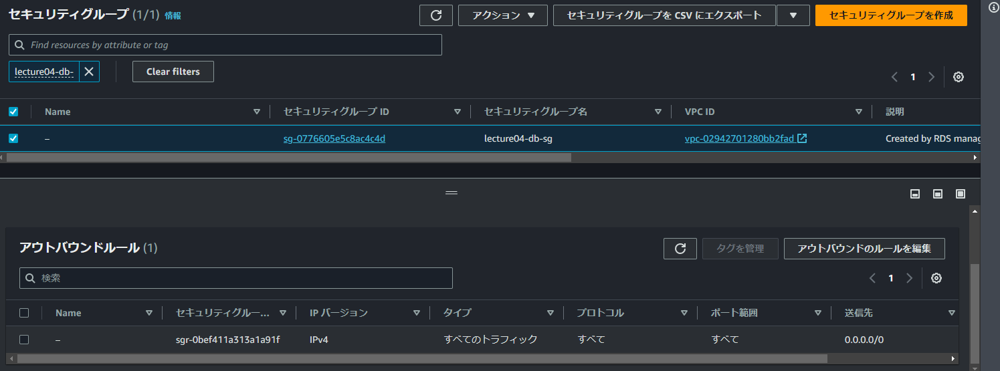

# 第4回講義課題

```Markdown
1. AWS 上に新しく VPC を作成する。
2. EC2 と RDS を構築する。
4. EC2 から RDS へ接続をし、正常であることを確認する。
```

## VPC作成

### VPCの設定

- VPCなど(VPCと他のネットワークソースを作成)
- Nameタグの自動生成にチェック(VPC内の全てのリソースのNameタグを自動生成する)
- IPv4CIDRブロック 10.0.0.0/16

> [!NOTE]
>
> - "10.0.0.0"がネットワークアドレス、"/16"がサブネットマスクのビット数を示している。
> - 使用可能なIPアドレスの範囲は10.0.0.1 〜 10.0.255.254の65536個のIPアドレスとなる。

- IPv6 CIDRブロックなし
- アベイラビリティゾーン(AZ) 2
- パブリックサブネット 2
- プライベートサブネット 2
- DNSオプション 有効化  

  VPCとサブネット、IGWが自動作成される
  

## EC2作成

### EC2の設定

- AmazonLinux2,t2.micro(無料枠)を選択
- キーペアを作成
- ネットワーク設定 編集する
  - 上記で作成したVPCを選択
  - 作成されるサブネットを選択
  - パブリックIPの自動割り当て 有効化
  - セキュリティグループを作成 ssh,ソースタイプを設定

  

### EC2セキュリティグループ

- 今回は自分しか使用しないためインバウンドルールはマイIPに設定する


## RDS作成

### RDSの設定

- 標準作成を選択
- MySQL
- 無料利用枠
- パスワードの設定
- EC2コンピューティングリソースに接続しないを選択
- VPCを選択(データベース作成後に変更できないので注意)
- DBサブネットグループ
  - PrivateSubnetを選んで作成しておき選択する
- パブリックアクセスなし
- VPCセキュリティグループ 新規作成
- アベイラビリティゾーン EC2と同じに設定
- 自動バックアップを無効にする

  
> [!WARNING]
> マスターパスワードは作成した時の[認証情報の詳細の表示]でしか確認できないので注意する。

## RDSセキュリティグループ

- インバウンドルールをEC2からの接続のみできるように`lecture04-sg`へ変更する
- インバウンドルールのソースをセキュリティグループに変更しようとした場合`既存のIPv4CIDRルールに1つの参照先のグループ IDを指定することはできません。`という警告が出る。
  - 右側にある「削除」をクリックし、対象ルールを一度削除する。
  - 「ルール追加」をクリックし、新規ルールを追加することで設定をアップデートできる。




## EC2でRDSに接続

- SSH接続クライアント：TeraTerm
- EC2には何もインストールされていない状態なので`$ sudo yum install mysql`でMySQLをインストールする。
- `$ mysql -u admin -p -h RDSのエンドポイントを張り付け`
- Enter Passwordを求められるので、RDSデータベース作成時のパスワードを入力するとMySQLへログインができる。


参考
- [【初心者向け】RDS for MySQLを構築しEC2からアクセスしてみる](https://dev.classmethod.jp/articles/sales-rds-ec2-session/)
- [既存の IPv4 CIDR ルールに 1 つの 参照先のグループ ID を指定することはできません。]( https://qiita.com/himorishuhei/items/7426cab6cd83c3d8e4e3)#Qiita 