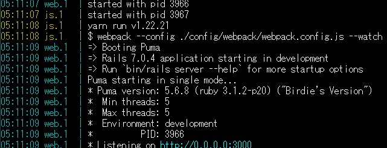
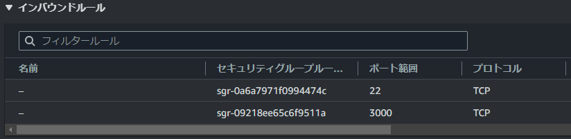
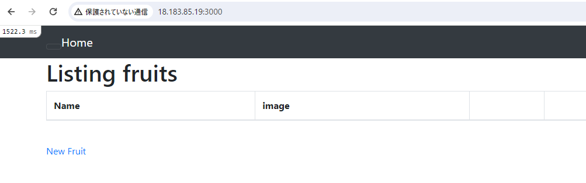
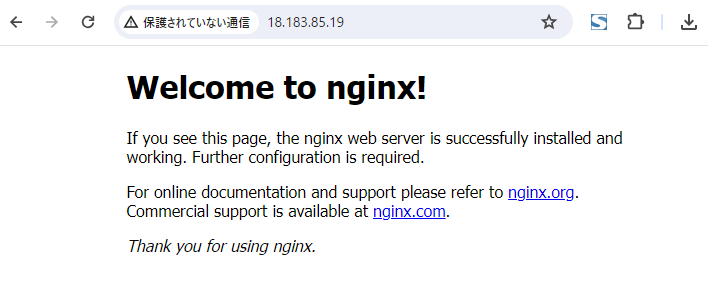
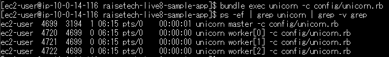
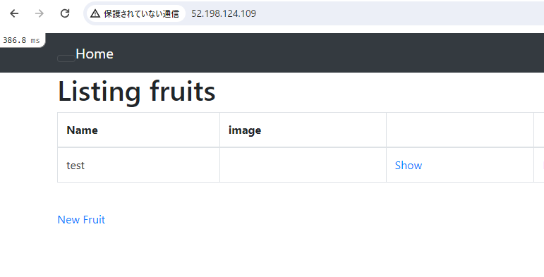
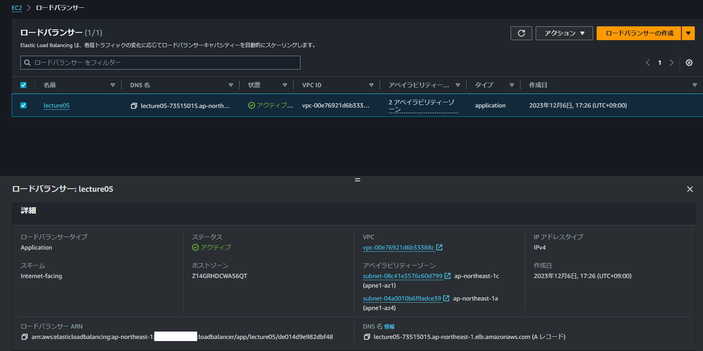
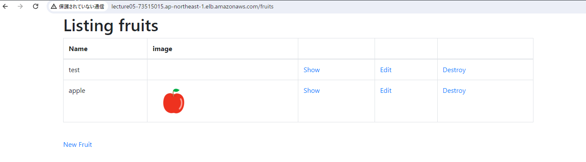
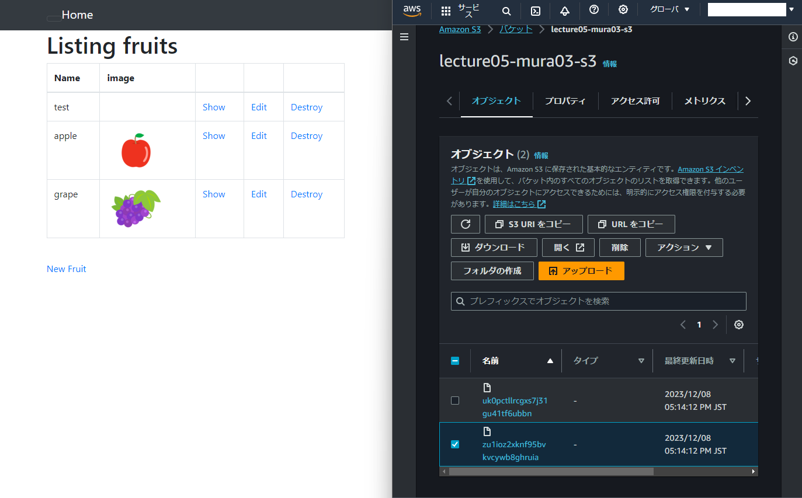

# 第5回講義課題

```Markdown
1. EC2 上にサンプルアプリケーションをデプロイ
  - まずは組み込みサーバーだけで動作確認する。
  - 動作したらサーバーアプリケーションを分けて動作確認を行う。
2. 動作したらELB(ALB)を追加
3. S3 を追加
4. 環境の構成図を作成
```

## 1.組み込みサーバーで動作確認

### sudo yum updateを実行

```sh
$ sudo yum update -y
```

### Railsに必要なパッケージをインストール

```sh

$ sudo yum install git bzip2 readline-devel zlib-devel gcc libyaml-devel libffi-devel gdbm-devel ncurses-devel gcc-c++ mysql-devel ImageMagick ImageMagick-devel epel-release
```

- 必要なパッケージについては[Railsコア開発環境の構築方法](https://railsguides.jp/development_dependencies_install.html)を参照

> [!NOTE]
>
> - Linuxにおいてリポジトリとはパッケージを管理しておく場所で、パッケージの倉庫のようなもの。
>   - リポジトリ:ソフトウェアが保管されている場所
>   - パッケージ:ソフトウェアの一連のファイルをまとめたもの
> - パッケージを使用する時はリモートリポジトリをローカルにダウンロードして、ローカル内のリポジトリからパッケージをインストールする。
> - Amazon Linux 2ではamzn2-core、および amzn2extra-dockerが有効になっている。

参考

- [パッケージ管理 入門（Redhat系）](https://envader.plus/course/11/scenario/1122#Linux%E3%81%AB%E3%81%8A%E3%81%91%E3%82%8B%E3%83%AA%E3%83%9D%E3%82%B8%E3%83%88%E3%83%AA%E3%81%AE%E6%A6%82%E5%BF%B5)
- [yumコマンドでパッケージ管理](https://www.wakuwakubank.com/posts/275-linux-yum/ )

### rbenv,ruby-buildのインストール

- rebenvは簡単にrubyのバージョンを切れ変えられるツール
- ruby-buildはrubyをインストールするためのrbenvプラグイン

```sh
$ git clone https://github.com/rbenv/rbenv.git ~/.rbenv
$ git clone https://github.com/rbenv/ruby-build.git ~/.rbenv/plugins/ruby-build
$ sudo ~/.rbenv/plugins/ruby-build/install.sh
$ echo 'export PATH="$HOME/.rbenv/bin:$PATH"' >> ~/.bash_profile
$ echo 'eval "$(rbenv init -)"' >> ~/.bash_profile
$ source ~/.bash_profile
```

>[!WARNING]
>rbenvからインストールしないとエラーが出るので注意。

### rubyのインストール

```sh
$ rbenv install 3.1.2
$ rbenv global 3.1.2
$ rbenv rehash
```

### bundlerのインストール

- bundlerは、gemの依存関係とバージョンを管理するためのgem。
- gem同士の関係で問題が発生しないようにgemをインストールしたり、プロジェクトごとに分けることが可能となる。

```sh
$ gem install bundler -v 2.3.14
```

### railsのインストール

```sh
$ gem install rails -v 7.0.4
$ rails -v
Rails 7.0.4
```

### nvmのインストール

- Node.jsが必要なのでnvmをインストールする。
- nvmとは、rbenvのようなnodeのバージョンを切り替えられるツール。

```sh
$ curl -o- https://raw.githubusercontent.com/nvm-sh/nvm/v0.39.5/install.sh | bash
#nvmを有効にする
$ . ~/.nvm/nvm.sh
```

### Node.jsのインストール

```sh
$ nvm install 17.9.1
$ node -v
v17.9.1
```

### yarnのインストール

```sh
$ npm install yarn -g
```

### サンプルアプリのclone

```sh
$ git clone https://github.com/yuta-ushijima/raisetech-live8-sample-app.git
#サンプルアプリのディレクトリに移動
$ cd raisetech-live8-sample-app
```

### MySQLのインストールと起動確認

```sh
# mariadbを確認
$ yum list installed | grep mariadb
mariadb-devel.x86_64                1:5.5.68-1.amzn2.0.1             @amzn2-core
mariadb-libs.x86_64                 1:5.5.68-1.amzn2.0.1             installed  
# mariadbを削除
$ sudo yum remove mariadb-*
```

>[!NOTE]
> 元々インストールされているmariaDBを削除しておかないとMysqlが動作しないので削除する。

```sh
# MySQLのリポジトリをyumに追加する
$ sudo yum localinstall -y https://dev.mysql.com/get/mysql80-community-release-el7-11.noarch.rpm
# 必要なパッケージをインストールする
$ sudo yum install -y --enablerepo=mysql80-community mysql-community-server
$ sudo yum install -y --enablerepo=mysql80-community mysql-community-devel
```

```sh
# mysqlと関連パッケージがインストールされていることを確認
$ yum list installed | grep mysql
mysql-community-client.x86_64         8.0.35-1.el7                   @mysql80-community
mysql-community-client-plugins.x86_64 8.0.35-1.el7                   @mysql80-community
mysql-community-common.x86_64         8.0.35-1.el7                   @mysql80-community
mysql-community-devel.x86_64          8.0.35-1.el7                   @mysql80-community
mysql-community-icu-data-files.x86_64 8.0.35-1.el7                   @mysql80-community
mysql-community-libs.x86_64           8.0.35-1.el7                   @mysql80-community
mysql-community-server.x86_64         8.0.35-1.el7                   @mysql80-community
mysql80-community-release.noarch      el7-5                          installed
```

```sh
# MySQLのバージョンを確認
$ mysql --version
mysql  Ver 8.0.35 for Linux on x86_64 (MySQL Community Server - GPL)
# /var/log/mysqld.log ファイルを作成
$ sudo touch /var/log/mysqld.log
# MySQLの起動と確認
$ sudo systemctl start mysqld
$ sudo systemctl status mysqld.service
● mysqld.service - MySQL Server
   Loaded: loaded (/usr/lib/systemd/system/mysqld.service; enabled; vendor preset: disabled)
   Active: active (running) since Mon 2023-12-04 06:07:23 UTC; 18s ago
     Docs: man:mysqld(8)
           http://dev.mysql.com/doc/refman/en/using-systemd.html
  Process: 1568 ExecStartPre=/usr/bin/mysqld_pre_systemd (code=exited, status=0/SUCCESS)
 Main PID: 1634 (mysqld)
   Status: "Server is operational"
   CGroup: /system.slice/mysqld.service
           mq1634 /usr/sbin/mysqld
```

### RDSと接続

```sh
# RDSと接続
# database.yml.sampleを複製しdatabase.ymlを作成
$ cp config/database.yml.sample config/database.yml
# database.ymlを編集
$ vim config/database.yml
default: &default
  adapter: mysql2
  encoding: utf8mb4
  pool: <%= ENV.fetch("RAILS_MAX_THREADS") { 5 } %>
  username: admin
  password: ****
  host:RDSのエンドポイント
```

### 環境構築

```sh
#環境構築
$ bin/setup
$ bin/dev
```

- アプリケーションの起動
  
  
- セキュリティグループにポート3000を追加

- http://自分のパブリックIPアドレス:3000で稼働確認


参考

- [AWS EC2 AmazonLinux2 MySQLをインストールする](https://qiita.com/miriwo/items/eb09c065ee9bb7e8fe06) #Qiita @mirimiripcより
- [AWS Rails 6 + MySQL + Nginx な環境の作成方法 サーバー編](https://takelg.com/aws_create_rails_development_server/)

## 2.Nginx+Unicornで起動

### ポート80を追加

### Nginxのインストール

```sh
#Nginxインストール
$ sudo yum install http://nginx.org/packages/centos/7/noarch/RPMS/nginx-release-centos-7-0.el7.ngx.noarch.rpm -y
#Nginxのリポジトリをインストール
$ sudo yum install nginx -y
#Nginx接続確認
$ sudo systemctl start nginx.service
```

```sh
# Nginxの起動確認
$ sudo systemctl status nginx.service
● nginx.service - nginx - high performance web server
   Loaded: loaded (/usr/lib/systemd/system/nginx.service; disabled; vendor preset: disabled)
   Active: active (running) since Mon 2023-12-04 10:32:52 UTC; 8s ago
     Docs: http://nginx.org/en/docs/
  Process: 4802 ExecStart=/usr/sbin/nginx -c /etc/nginx/nginx.conf (code=exited, status=0/SUCCESS)
 Main PID: 4803 (nginx)
   CGroup: /system.slice/nginx.service
           tq4803 nginx: master process /usr/sbin/nginx -c /etc/nginx/nginx.conf
           mq4804 nginx: worker process
```

- 接続画面


### Unicornの起動

```sh
# Unicornの起動
$ bundle exec unicorn -c config/unicorn.rb
# 起動確認
$ps -ef | grep unicorn | grep -v grep
```



### nginxの設定変更

```sh
upstream unicorn {
    server  unix:/home/ec2-user/raisetech-live8-sample-app/unicorn.sock;
}

server {
    listen       80;
    server_name  パブリックIPアドレス;

    access_log  /var/log/nginx/access.log;
    error_log   /var/log/nginx/error.log;

    root /home/ec2-user/raisetech-live8-sample-app/public;

    client_max_body_size 100m;
    error_page  404              /404.html;
    error_page  500 502 503 504  /500.html;
    try_files   $uri/index.html $uri @unicorn;

    location @unicorn {
        proxy_set_header X-Real-IP $remote_addr;
        proxy_set_header X-Forwarded-For $proxy_add_x_forwarded_for;
        proxy_set_header Host $http_host;
        proxy_pass http://unicorn;
    }
}
```

### 502 Bad Gateway


- エラーログを確認する
```sh
$ tail -n 5 /var/log/nginx/error.log
*27 stat() "/home/ec2-user/raisetech-live8-sample-app/public/" failed (13: Permission denied)
*27 connect() to unix:/home/ec2-user/raisetech-live8-sample-app/unicorn.sock failed (13: Permission denied)
```

- エラーログより(13: Permission denied)と表示があり、権限が足りていないことが分かる。

```sh
# /home/ec2-user/raisetech-live8-sample-app ディレクトリとそのサブディレクトリ、ファイルが ec2-user:ec2-user の所有者であることを確認。
$ sudo chown -R ec2-user:ec2-user /home/ec2-user/raisetech-live8-sample-app
# 同様に、ディレクトリとファイルが適切な権限を持っているか確認する。
$ find /home/ec2-user/raisetech-live8-sample-app -type d -exec chmod 755 {} \;
$ find /home/ec2-user/raisetech-live8-sample-app -type f -exec chmod 644 {} \;
#再起動
$ kill -9 xxxxx
$ bundle exec unicorn -c config/unicorn.rb
$ sudo systemctl restart nginx
```

- NginxとUnicornで起動確認。


参考

- [【Rails】 AWSのEC2にデプロイする方法~画像で丁寧に解説！](https://pikawaka.com/rails/ec2_deploy)
- [Rails開発におけるwebサーバーとアプリケーションサーバーの違い（翻訳）](https://qiita.com/jnchito/items/3884f9a2ccc057f8f3a3) #Qiita @jnchitoより 
- [AWS & Nginx & Unicorn & Ruby on Rails](https://hackmd.io/@z6b3_Eq5SKu_7fFSamBfaw/HkMXbpJVD)
- [【CentOS 7】Nginx + Unicorn で Rails アプリケーションを本番環境で立ち上げる方法｜Kosuke Aoki](https://zenn.dev/noraworld/articles/deploy-rails-application-with-nginx-and-unicorn) #zenn 
- [Nginxの設定で詰まった話](https://qiita.com/koinunopochi/items/38481f0f8f77c5f8836a) #Qiita @a1a2a3b1b2b3b4より 
- [Unicornを再起動する](https://qiita.com/vinaka/items/90a31d23297b9a1cd65d) #Qiita @pandapukinより

## 3.ロードバランサーの設置

- EC2ダッシュボードより作成
- config/environments/development.rbに追記

```sh
Rails.application.configure do
（中略）
  config.hosts << "lecture05-73515015.ap-northeast-1.elb.amazonaws.com"
（中略）
end
```

- DNS名で接続確認



## 4.S3の設置

- IAMロールを作成
- EC2インスタンスにアタッチ
- インスタンスを再起動
- NginxとUnicornを起動

S3へ画像のアップロードを確認

## 5.構成図作成


