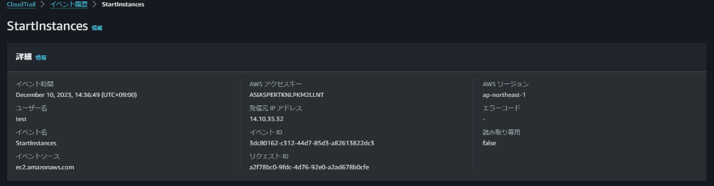
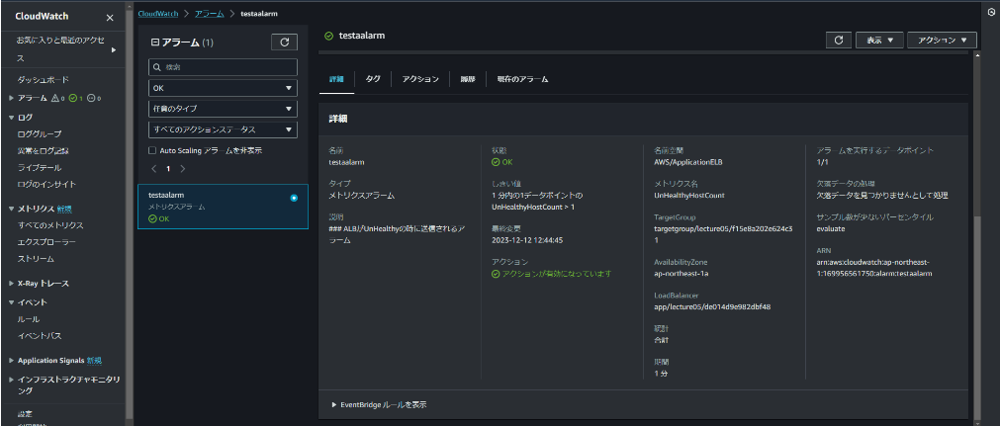
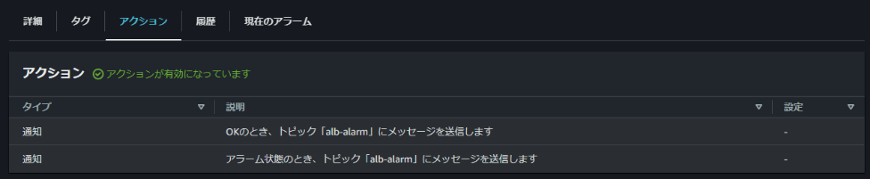
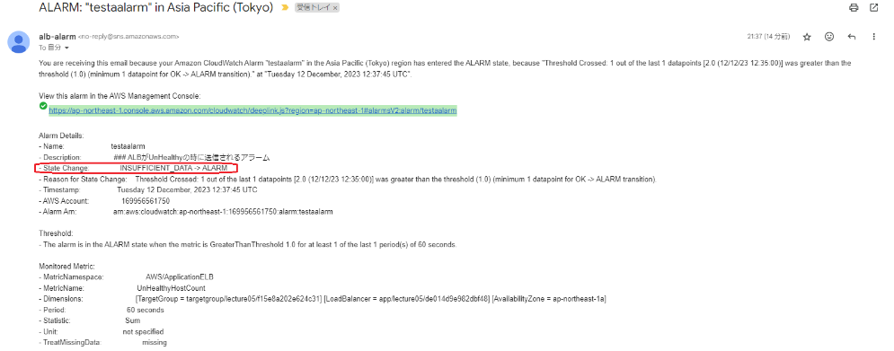
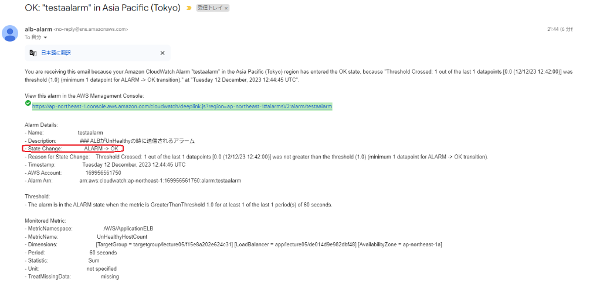
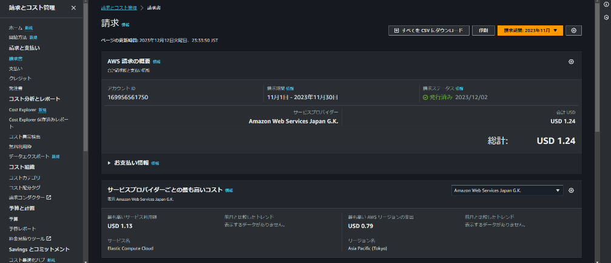
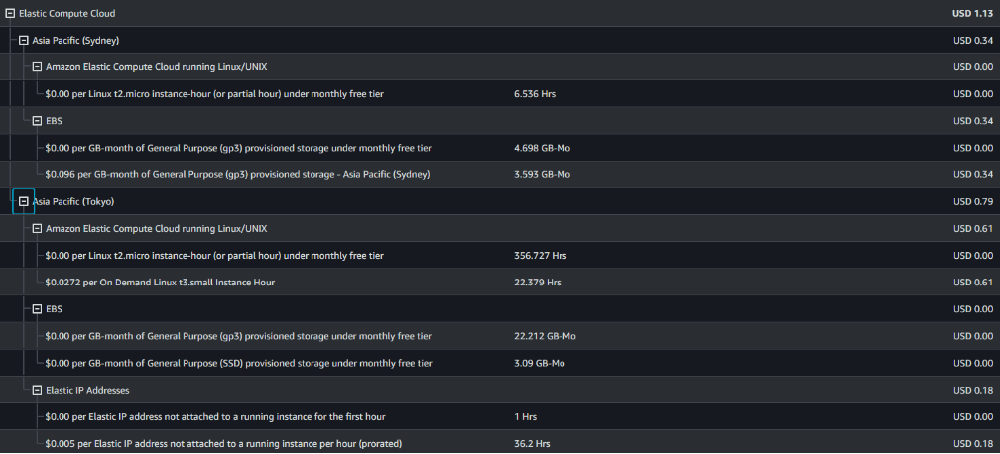

# 第6回講義課題

```Markdown
1. 最後にAWSを利用した日の記録を、どれでもよいのでCloudTrailのイベントから探し出す。
    - イベント名と、含まれている内容3つをピックアップする。
2. CloudWatch アラームを使って、ALB のアラームを設定しメール通知を行う。
    - メールにはAmazon SNS を使用。
    - デモンストレーションでは設定していないがOKアクションも設定する。
```

## CloudTrailのイベント

EC2インスタンスの起動


含まれている内容

- イベント名:StartInstances
- ユーザー名:test
- イベント時間 December 10,2023,14:36:49(UTC+09:00)
- 発信元IPアドレス:14.10.35.32

## CloudWatchでALBアラームを設定する


- アクションの設定

- メールでの通知
Railsアプリケーションが使えない状態

- Railsアプリケーションが使える状態


---

- アラームをかけたいものがメトリクスで管理できる
- どのメトリクスが何を指しているのかよく使うものについては理解しておくようにする

## AWSの見積もりの作成

https://calculator.aws/#/estimate?id=717f7e8c41bf73e391a8718fa9e033f56912c52c

## 現在の利用料




- EC2インスタンスを何度も複数作成したためEBSの無料利用枠を超えてしまった。
- ElasticIPをインスタンスにアタッチしないままにしていた時期があり料金が発生している。

---

- 無料利用と思って気楽に使っていたが、意外と分からない部分で利用料がかかってくる場合がある。
- 見積もりを立ててみると課題のように利用しているサービスが少なくても運用するとなると高額になることが分かり、仕事で使う場合はさらにどこでどうコストがかかっているか・いらないサービスが稼働していないかを精査しないといけないだろうということが理解できた。
