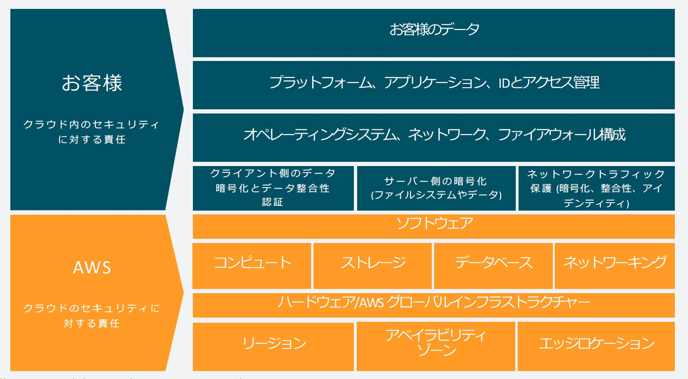

# 第7回講義課題

```markdown
1. 今回の講義について感想や疑問を課題とし報告
     - 作っている環境は、どんな攻撃にたいして「脆弱」か？
     - どのような対策が取れるか？
```

## AWSのセキュリティ対策

### 責任共有モデル

- 「責任共有モデル」とは、クラウドサービス提供者であるAWSと、サービス利用者がセキュリティに関する責任範囲を明確分けて、それぞれ担当する範囲において必要なセキュリティ対策を実施することで、サービス全体のセキュリティを担保しようという考え方。

出典：[AWS責任共有モデル](https://aws.amazon.com/jp/compliance/shared-responsibility-model/)

  ### AWS の “クラウドのセキュリティ” 責任

  > AWS は、AWS クラウドで提供されるすべてのサービスを実行するインフラストラクチャの保護について責任を負います。このインフラストラクチャはハードウェア、ソフトウェア、ネットワー キング、AWS クラウドのサービスを実行する施設で構成されます。

  ### 利用者の “クラウドにおけるセキュリティ” 責任

  > お客様の責任は、選択した AWS クラウドのサービスに応じて異なります。選択によって、セキュリティに関する責任の一環としてお客様が実行する構成作業の量が決定されます。たとえば、Amazon Elastic Compute Cloud (Amazon EC2) などのサービスは Infrastructure as a Service (IaaS) に分類されているため、必要なすべてのセキュリティ構成および管理のタスクをお客様が実行する必要があります。お客様が Amazon EC2 インスタンスをデプロイした場合、お客様は、ゲストオペレーティングシステムの管理 (更新やセキュリティパッチなど)、インスタンスにインストールしたアプリケーションソフトウェアまたはユーティリティの管理、AWS より各インスタンスに提供されるファイアウォール (セキュリティグループと呼ばれる) の構成に責任を負います。 Amazon S3 や Amazon DynamoDB などの抽象化されたサービスの場合、AWS はインフラストラクチャレイヤー、オペレーティングシステム、およびプラットフォームを運用し、お客様はエンドポイントにアクセスしてデータを保存および取得します。お客様は、データの管理 (暗号化オプションを含む)、アセットの分類、IAM ツールでの適切な権限の適用について責任を負います。

### 予防的統制と発見的統制

#### 「予防的統制」とは
- セキュリティインシデントの原因となる問題を取り除く、もしくは、軽減させるための対策。
  1. ポリシーと手順  
    明確なセキュリティポリシーと手順の策定は、組織内のセキュリティ意識を高め、一貫した対応を促進する
  2. 物理的および技術的な障壁  
    不正アクセスを防ぐための物理的なセキュリティ措置や技術的な障壁（ファイアウォール、暗号化など）を設置する
  3. アクセス管理  
    アクセス権限を必要な人々にのみ与え、不必要なアクセスを制限することで、セキュリティリスクを軽減する

#### 「発見的統制」とは

- セキュリティに関わるイベントが発生した際に、問題の早期検知と記録を行い、進行中のインシデントに対して関係者にアラートをあげるような統制を指す。
   1. 監視とアラート  
      システムの監視と異常アラートは、セキュリティインシデントの早期発見に不可欠
   2. インシデントレスポンスプラン  
       事前に定義されたインシデントレスポンスプランは、発見された脅威に迅速かつ効果的に対応するために重要
   3. 事後分析とフィードバックループ  
      インシデント発生後の分析とフィードバックは、将来的なセキュリティ向上に役立つ

### AWSのセキュリティ強化サービス

#### 予防的統制に寄与するサービス

1. AWS IAM (Identity and Access Management)
2. AWS Shield
3. AWS WAF (Web Application Firewall)

#### 予防的統制と発見的統制両方に寄与するサービス

1. AWS CloudTrail
2. AWS Config
3. Amazon Detective
4. Amazon GuardDuty
5. Amazon Inspector
6. Amazon OpenSearch Service
7. AWS Security Hub
8. VPC Flow Logs

参考  

- [AWSのセキュリティ対策の基本とベストプラクティス](https://cloudnavi.nhn-techorus.com/archives/5104)
- [[2021年版]AWSセキュリティ対策全部盛り[初級から上級まで] というタイトルでDevelopersIO 2021 Decadeに登壇しました #devio2021](https://dev.classmethod.jp/articles/aws-security-all-in-one-2021/)
- [愛してやまないAWSで展開するセキュリティ対策戦略](https://zenn.dev/levtech/articles/security-strategy-in-aws)