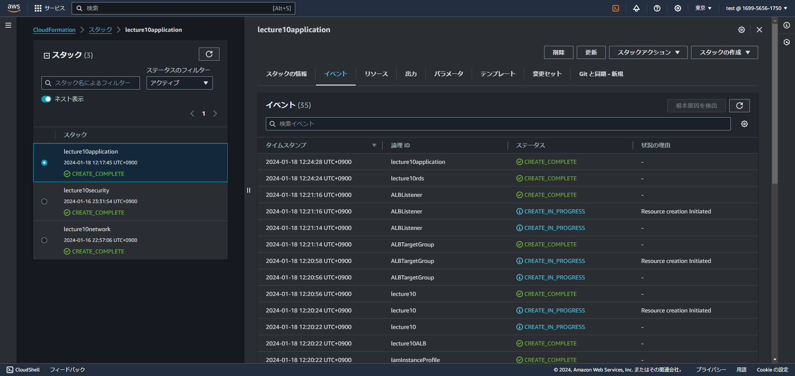
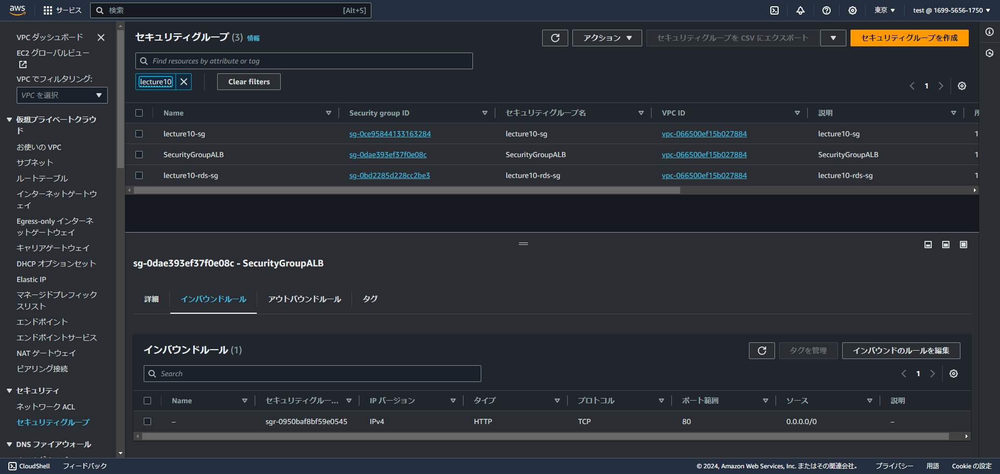
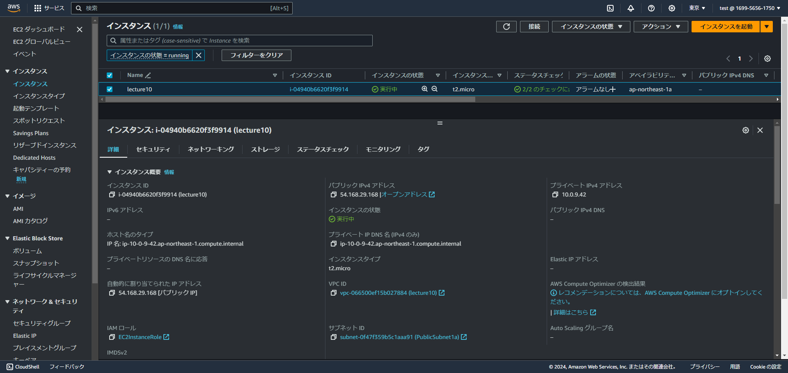
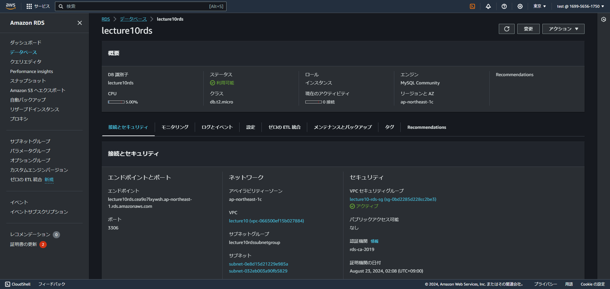
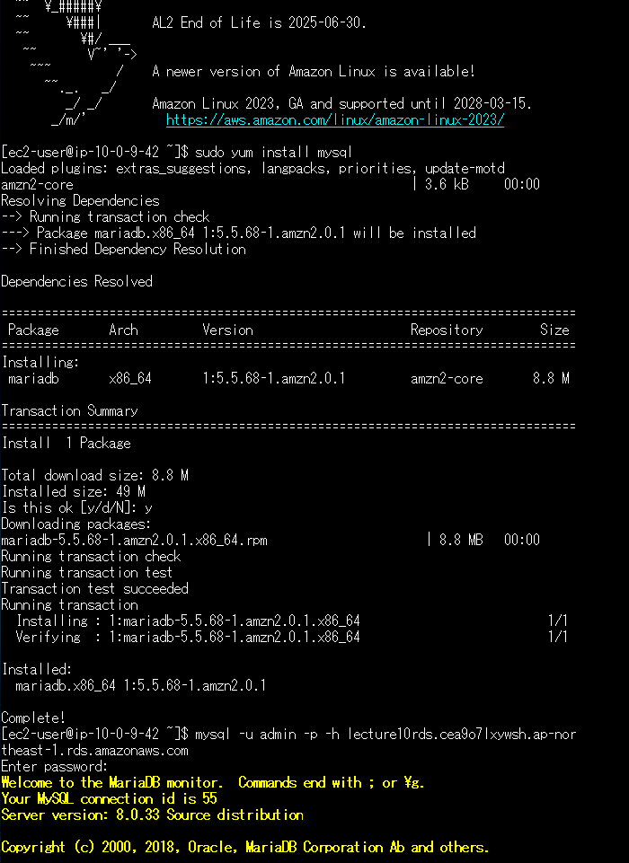
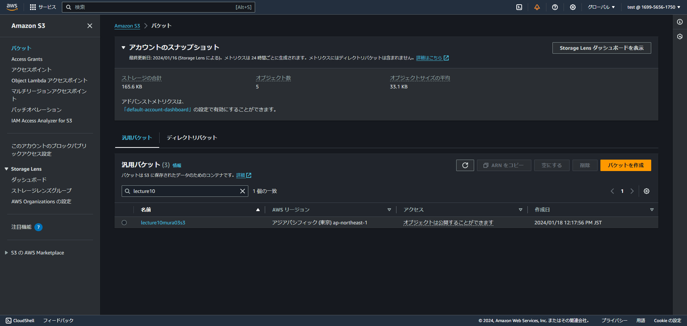

## 第10回講義課題
- CloudFormation を利用して、現在までに作った環境をコード化し、コード化ができたら実行してみて、環境が自動で作られることを確認を行う。

#### CLoudFormationでコード化
- ネットワーク、セキュリティ、アプリケーションのレイヤーにそれぞれ分けて作成。

|                                   |                                                                                                        | 
| :-------------------------------: | ------------------------------------------------------------------------------------------------------ | 
| Network_Layer             | VPC PublicSubnet PrivateSubnet InternetGateWay RouteTable                                  | 
| Security_Layer                | EC2SecurityGroup RDSSecurityGroup ALBSecurityGroup                                               | 
| Application_Layer | EC2 RDS Secrets Managet RDSSubnetGroup ALB ALBTargetGroup ALBLisner S3 IAMRole | 

#### 実際のテンプレート
[CloudFormationTemplate](https://github.com/murari-mura03/RaizeTech/tree/b251fcb773272abd6ce57e084ac8793990aa4f55/CloudFormation "Template")

- リソース作成確認

#### VPC

- PubulicSubnet、privateSubnet各2つ作成

#### SecurityGroup

- EC2、RDS、ALB用に3つ作成

#### EC2

#### RDS

- パスワード保護のためSecretsManagerを使用。

#### EC2からRDSへSSH接続確認

#### S3
