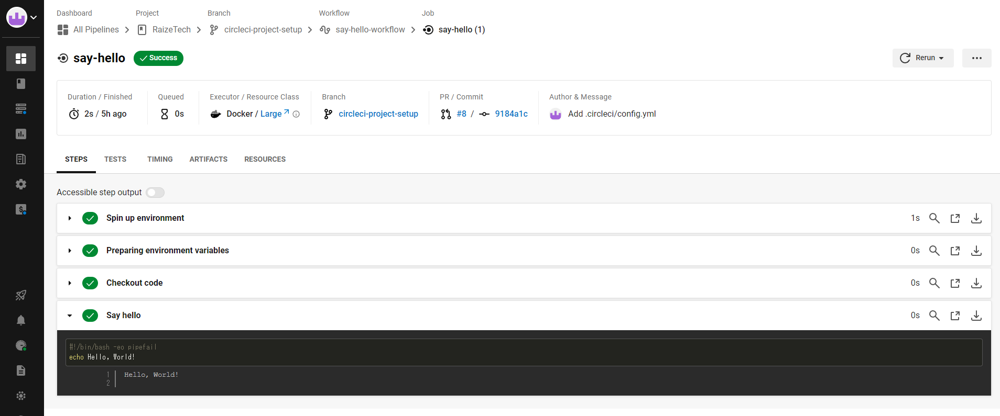
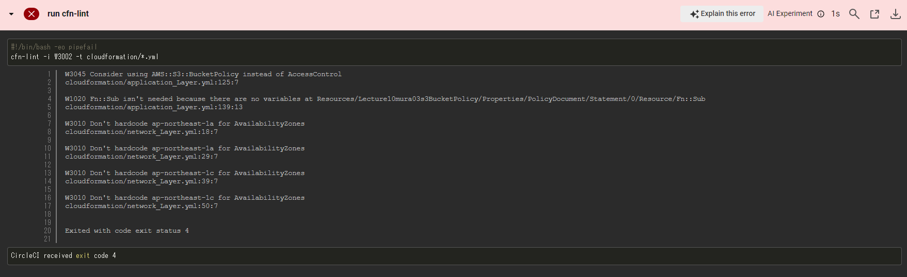
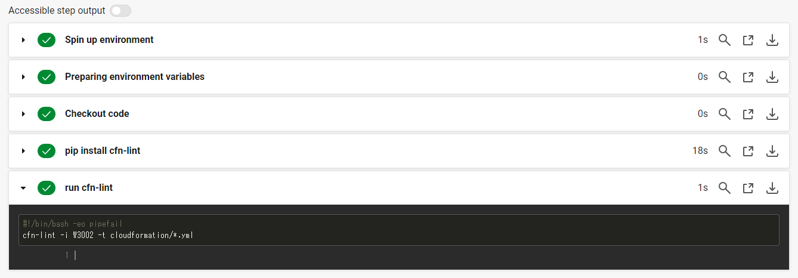

# 第12回講義課題
+ [CircleCIのサンプルコンフィグ](https://github.com/MasatoshiMizumoto/raisetech_documents/tree/main/aws/samples/circleci)をリポジトリに組み込み、正しく動作させる。

## CiecleCIとは
- CircleCIとは、Saas型のCI/CDサービス。ビルド・テスト・デプロイを自動で行うことができる。  
  

```markdown
1. ビルド
・ソースコードから実行可能なアプリケーションを構築する。  
・具体的には、Dockerイメージのpull、依存パッケージのインストール、コンパイルなど。 
2. テスト  
・UTなどのテストコードを実行して動作確認をしたり、Rubocop(Ruby)などのコードスタイルチェックなどを行う。  
3. デプロイ
・ビルドしてテストが通ったものを本番環境や検証環境などにリリースする。
```

## 手順  
### 1. [公式ドキュメント](https://circleci.com/docs/ja/getting-started/)通りに操作しCiecleCIに接続する。
   + circleci-project-setupというブランチに.circleci/config.ymlが作成される。
   + パイプライン上でsay-hello-workflowというジョブが実行される。
    
   + ジョブの成功を確認。
### 2. 新しくブランチを作成(lecture12)し.circleci/config.ymlをプッシュする。
   + /.circleciにconfig.ymlをCircleCIのサンプルコンフィグへ変更する。
```   
version: 2.1
orbs:
  python: circleci/python@2.0.3
jobs:
  cfn-lint:
    executor: python/default
    steps:
      - checkout
      - run: pip install cfn-lint
      - run:
          name: run cfn-lint
          command: |
            cfn-lint -i W3002 -t cloudformation/*.yml   

workflows:
  raisetech:
    jobs:
      - cfn-lint
```
 + エラーが発生


### エラー内容
---
  + AccessControlを使用する代わりにAWS::S3::BucketPolicyを使用することを検討するよう勧告。
  + cloudformation/Application_Layer.ymlファイルの139行目変数が見つからないため、Fn::Subの記述が不要であることの指摘。
  + リージョン固有の値をハードコードしていることを指摘。パラメーターまたはリファレンスを使用して、柔軟性を持たせることが推奨される。

### 3. エラー内容を修正し再度テストを施行
+ [cloudformationテンプレート](/cloudformation/)内の当該箇所を修正し再テストする。
   
   + 成功を確認。