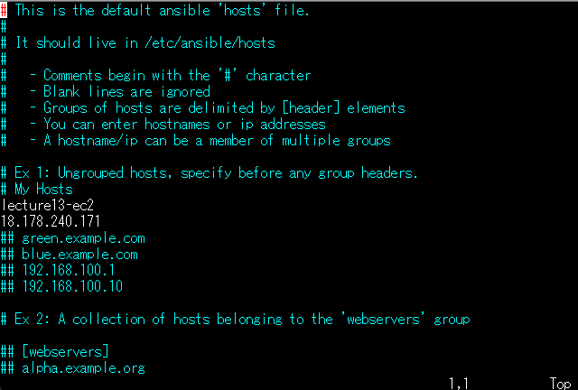
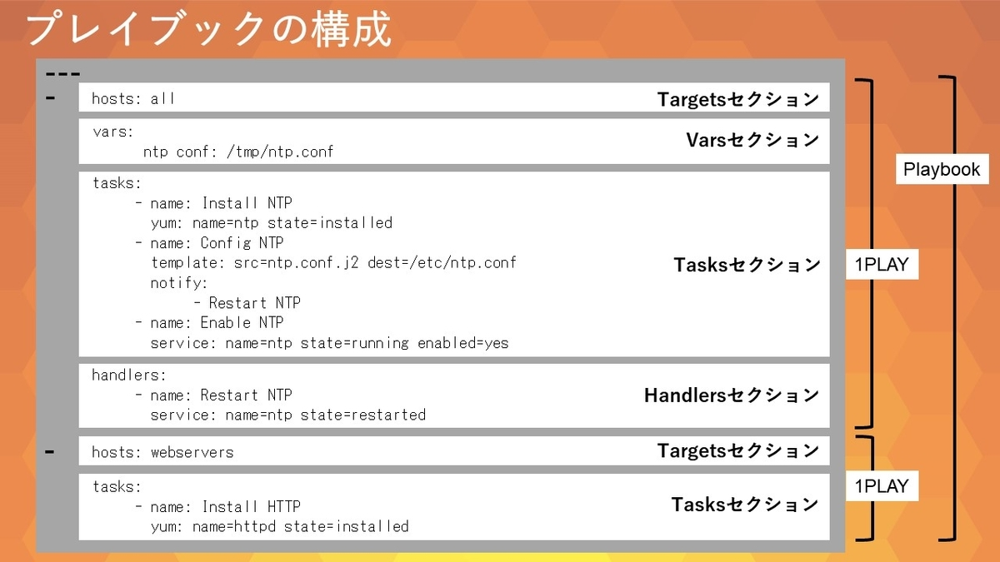
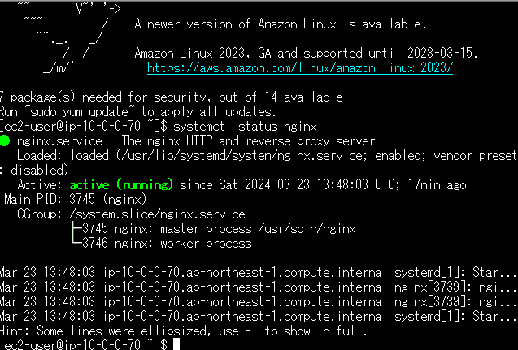

# 第13回講義課題

```text
CircleCI のサンプルに ServerSpec や Ansible の処理を追加し結果を報告
```

## webアプリケーションのデプロイ環境を自動構築する

### 構成図


### 作成したコード

https://github.com/murari-mura03/lecture13

- 実際のコード、実行結果の証跡など細かい設定はこちらのリポジトリへ記載しています

### 使用ツール

```sh
1.CircleCI
- Cloudformation、Ansible、serverspecの実行

2.Cloudformation

- 第10回講義課題で作成したテンプレートを使用
- VPC、EC2、ELB、RDS、S3、IAMを作成

3.Ansible

- EC2へサンプルアプリケーション用の設定作業を行う
- MySQL、Ruby、Nginx、puma

4.serverspec

ミドルウェア起動確認、アプリケーションレスポンス確認
```

- 以上を使用し自動化を行った

---

## Ansible導入手順

- Ansible初回使用時手間取ったこともあり以下導入の手順を記載しておく
- 同AZ上にEC2を2台設置しEC2-master(Master)からlecture13-ec2(Target)へnginxのインストールを行う

## Ansibleインストール

- EC2-masterへSSH接続
- `vim terraform_keypair.pem`でキーペア情報を登録する
  (teratarmに.pemファイルをドロップするだけで登録できる)
- `sudo amazon-linux-extras install ansible2` Ansibleをインストール
- バージョン確認

```sh
$ ansible --version
ansible 2.9.23
```

## 疎通確認

- キセキュリティの観点からーペアファイルの権限を変更
- `chmod 400 terraform_keypair.pem`
- インベントリファイルの作成
  
```sh
$ vim inventory.txt
# inventory.txtの中身
lecture13-ec2 ansible_host=54.150.45.207 ansible_connection=ssh ansible_user=ec2-user
```

- pingで疎通確認を行う
`ansible lecture13-ec2 -m ping -i inventory.txt`
- エラーが発生

```sh
ecture13-ec2 | UNREACHABLE! => {
    "changed": false,
    "msg": "Failed to connect to the host via ssh: Warning: Permanently added '18.178.240.171' (ECDSA) to the list of known hosts.\r\nPermission denied (publickey,gssapi-keyex,gssapi-with-mic).",
    "unreachable": true
}
```

- sshエージェントを起動する必要がある

```sh
$ ssh-agent bash
$ sudo cp terraform_keypair.pem ~/.ssh/
$ ssh-add ~/.ssh/terraform_keypair.pem

# エラー
# /home/ec2-user/.ssh/terraform_keypair.pem: Permission denied
# sudo chmod 400 /home/ec2-user/.ssh/terraform_keypair.pem
# sudo chown ec2-user:ec2-user /home/ec2-user/.ssh/terraform_keypair.pem

Identity added: /home/ec2-user/.ssh/terraform_keypair.pem (/home/ec2-user/.ssh/terraform_keypair.pem)
# sudo chmod 755 /home/ec2-user/.ssh/terraform_keypair.pemでも可

$ ansible lecture13-ec2 -m ping -i inventory.txt

lecture13-ec2 | SUCCESS => {
    "ansible_facts": {
        "discovered_interpreter_python": "/usr/bin/python"
    },
    "changed": false,
    "ping": "pong"
```

## hostsファイルの変更

`sudo vim /etc/ansible/hosts`


## playbookの作成


- playbookの基本構成

 (出典: Ansible実践ガイド第3版 著: 北山晋吾、佐藤学、塚本正隆、畠中幸司、横地晃[インプレス刊] P82 Figure 3-4 プレイブックの構成)
- Ansible公式 [modules](https://docs.ansible.com/ansible/latest/module_plugin_guide/index.html) Playbookでタスクを記述する際はモジュールを指定して記述

`vim install_nginx.yaml`

```sh
- name: Setup nginx server on myserver list (host group)
  hosts:
    - lecture13-ec2
  become: ture
  tasks:
    - name: Install the latest version of nginx
      command: amazon-linux-extras install nginx1 -y

    - name: Start nginx service
      service:
        name: nginx
        state: started
        
    - name: Enable nginx service
      service:
        name: nginx
        enabled: yes
        
    - name: Get nginx Installed version
      command: nginx -v

    - name: Get status of nginx service
      command: systemctl status nginx
```

`ansible-playbook install_nginx.yaml -v`

```sh
Using /etc/ansible/ansible.cfg as config file

PLAY [Setup nginx server on myserver list (host group)] ******************************************************

TASK [Gathering Facts] ***************************************************************************************
fatal: [lecture13-ec2]: UNREACHABLE! => {"changed": false, "msg": "Failed to connect to the host via ssh: ssh: Could not resolve hostname lecture13-ec2: Name or service not known", "unreachable": true}

PLAY RECAP ***************************************************************************************************
lecture13-ec2              : ok=0    changed=0    unreachable=1    failed=0    skipped=0    rescued=0    ignored=0
```

```sh
# /etc/ansible/hostsに追記

[lecture13-ec2:vars]
ansible_ssh_user=ec2-user
ansible_ssh_private_key_file=/home/ec2-user/.ssh/terraform_keypair
```

- エラーが変化
  
  ```txt
  fatal: [175.41.201.255]: FAILED! => {"changed": false, "msg": "No package matching 'epel-release' found available, installed or updated", "rc": 126, "results": ["No package matching 'epel-release' found available, installed or updated"]}
  ```

- epel-release パッケージが見つからないという内容のため`install_nginx.yaml`の内容を変更する

```yaml
- name: Setup nginx server on myserver list (host group)
  hosts: lecture13-ec2
  become: true
  tasks:
    - name: Enable EPEL repository
      command: amazon-linux-extras install epel -y

    - name: Install Nginx
      yum:
        name: nginx
        state: latest

    - name: Start nginx service
      service:
        name: nginx
        state: started

    - name: Enable nginx service
      service:
        name: nginx
        enabled: yes
```

- 成功  

```sh
PLAY RECAP *********************************************************************  
175.41.201.255             : ok=5    changed=4    unreachable=0    failed=0    skipped=0    rescued=0    ignored=0
```

  
