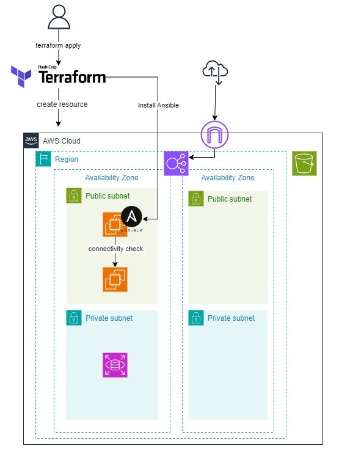
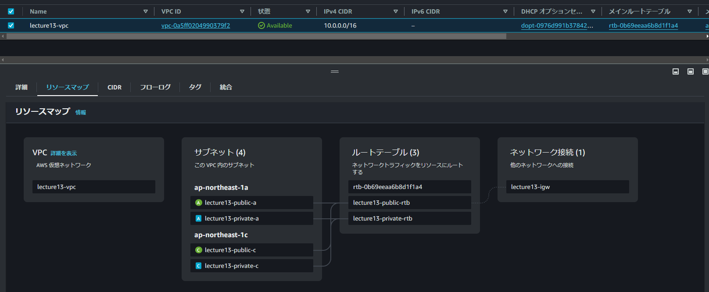
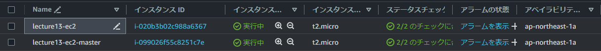
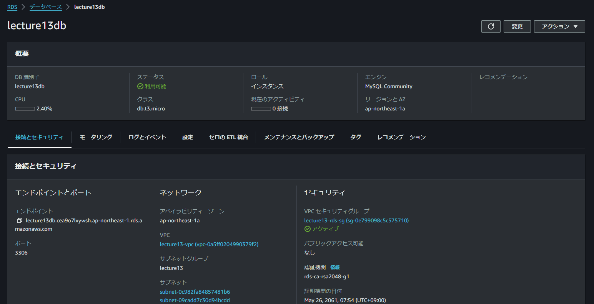
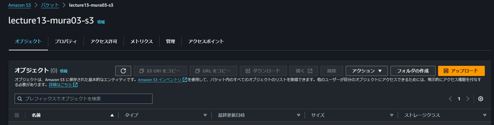
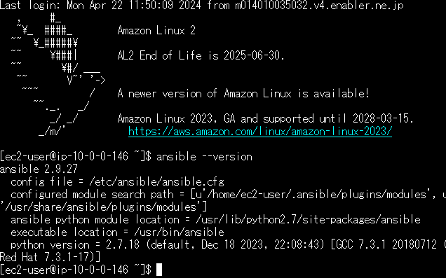
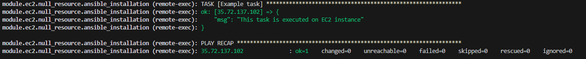

# Terraformを使用しAWSリソースの作成、AnsibleでEC2間の疎通確認を自動化

## 構成図



## 実際のコード

[terraform](terraform)

## ディレクトリ構成

```text
terraform
├─ main.tf
├─ terraform.tfvars
├─ variable.tf
├─ modules
|   ├─ec2  
|   ├─iam  
|   ├─lb   
|   ├─network
|   ├─rds  
|   └─s3  
├─ ansible_setup.yaml
└─ inventory.txt
```

## 概要

### 1.terraform applyを実行することでAWS上にリソースの作成

- VPC、EC2×2台、ELB、RDS、S3、IAMをそれぞれ作成

### 2.EC2(コントロールノード)にAnsibleのインストール

- provisioner機能の"remote-exec"を使用しコントロールノード用に作成したEC2へAnsibleのインストール、ターゲットノード用に作成したEC2へコントロールノードからの疎通確認を行う

### 各リソース作成画面
1. VPC

2. EC2 2台

3. RDS

4. S3

5. コントロールノードへAnsibleのインストール  

6. ターゲットノードへの疎通確認


## Terraform導入手順

### 事前準備

1. [Terraform公式サイト](https://developer.hashicorp.com/terraform/install?product_intent=terraform)からTerraformをDLする
2. システム環境変数の編集よりpathを通しておく
   - システム環境変数:新規→.exeファイルのフルパスを指定→ターミナルで`terraform -v`でバージョンの確認を行う
3. VScode:拡張機能`HashiCorp Terraform`をインストールしておく
   - 構文の強調表示、IntelliSense、コード ナビゲーション、コードの書式設定、モジュール エクスプローラーなどのTerraformファイルの編集機能が追加される

### .tfファイルの作成

```sh
# Configure the AWS Provider
#プロバイダーの設定
# https://registry.terraform.io/providers/hashicorp/aws/latest/docs
provider "aws" {
  region = "ap-******-1"
  access_key = "*******"
  secret_key = "*******"
}

# 上記で設定したプロバイダーに対してどういうリソースを作りたいのか記述
# Terraform Registryを確認しながら記載していく
#https://registry.terraform.io/providers/hashicorp/aws/latest/docs/resources/instance
resource "<provider>_<resource_type>" "name" {
  key1 = "value1"
  key2 = "value2"
}
```

**備考**  

- access_key,secret_key入手手順  
AWSコンソールのセキュリティ認証情報→アクセスキーの作成→アクセスキーID、シークレットアクセスキーをDL
- シークレットアクセスキーのDLは一度しかできないので注意

### コマンド

#### terraform init

- ワークスペースを初期化するコマンド。
- Terraform を実行するためには、まず`terraform init` でワークスペースの初期化が必要。
- .tf（テンプレート）ファイル内の plugin（aws provider など）のダウンロード処理などが走る。
- モジュールでリソースを追加変更時、バックエンドの設定を変更した場合などその都度実行する。

#### terraform validate

- Terraformの構成ファイル（.tfファイル）を検証するために使用する。
- 構成ファイルを読み込み、構文エラーや構成の問題をチェックする。

#### terraform plan

- Terraform による実行計画を参照するコマンド。
- .tf（テンプレート）ファイルに情報を元に、どのようなリソースが 作成/修正/削除 されるかを参照可能。

#### terraform apply

- .tf（テンプレート）ファイルに記載された情報を元にリソースを作成するコマンド。
- リソースが作成後、 terraform.tfstate に、作成されたリソースに関連する情報が保存される。
- 2度目以降の実行後には、1世代前のものが terraform.tfstate.backup に保存される。
- Terraform において、この状態を管理する terraform.state ファイルが非常に重要となるため、手動更新等は行わないこと。

#### terraform destroy

- 環境の削除

### Terraformファイルの内容

#### .terraform/provider

- `terraform init`で作成される。
- tfファイルで指定しているプロバイダーに接続するためのプラグインをインストールするためのファイルが作成される。

#### .terraform.lock.hcl

- `terraform init`コマンド実行時に、作業ディレクトリに生成されるファイル。
- terraform.lock.hclには`terraform init`時に決定した、プロバイダー(AWSなどの外部システムとその指定バージョン)とモジュール(.tfファイルに記述したコード)の依存関係や互換性が記録される。そうすることで、`terraform apply`実行時に同じ決定を使用できるようになる。

#### tfstate

- tfstateファイルはTerraformが管理しているリソースの現在の状態を表すファイル。
- `terraform apply`コマンドを実行した単位で作成される。
- tfstateから乖離してdestroyもapplyできなくなる場合があるので扱いは慎重に。
